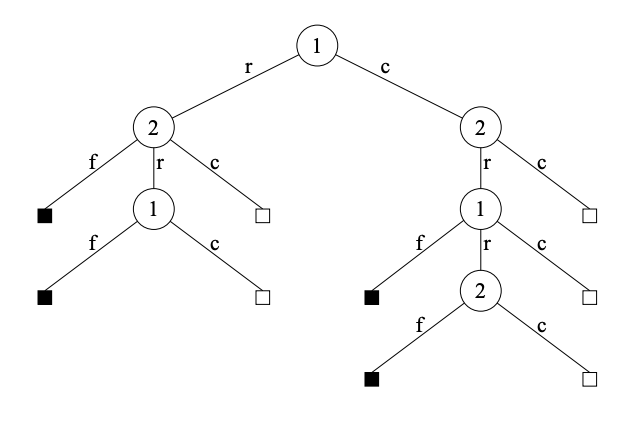

# Pluribus - A Multiplayer agent to play Poker variants
### This repo will hold an implementation of a pure Python implementation of Pluribus, Facebook's No-Limit 6-player Hold 'Em Poker Bot.

This will follow suit from some other reimplementations ([i.e.](https://github.com/karpathy/micrograd)) and aim to reimplemnt the main features of the Pluribus paper. This includes the equlibrium finding and depth limited solving. Currently, we will not implement the abstraction portion of the paper. We hope to extend this to Flop Hold'em. 

[Kuhn Poker](https://en.wikipedia.org/wiki/Kuhn_poker) 
===
Kuhn poker is a simplified game of poker where each player is given one card from a set of 3 cards. The third card is set aside. High card wins. We implement a variation of Kuhn poker where the three cards are chose from a set of 5 cards for three players. 

[Leduc Hold'em](http://poker.cs.ualberta.ca/publications/UAI05.pdf)
===
Leduc Hold'em is a poker variant where each player is dealt a card from a deck of 3 cards in 2 suits. The first round consists of a pre-flop betting round. The second round consists of a post-flop betting round after one board card is dealt. There is a two bet maximum per round, with raise sizes of 2 and 4 for each round. Each player antes 1 before the game starts.

Here is the game tree for one round of the game

Implementation of Pluribus
===================================
- [X] Monte Carlo Counterfactual Regret Minimization
    * Samples action in game tree rather than traversing entire game tree
    * One player is traverser on each iteration
    * Linear CFR in early iterations
    - [x] Two player Kuhn MCCFR
    - [x] Three player Kuhn MCCFR
    - [ ] Three player Leduc MCCFR

- [ ] Depth Limited Search
    * Blueprint strategy calculated to get coarse grained strategy
    * Search from all opponent actions to find best response
    - [ ] Real-time search Leduc Poker
    - [ ] Real-time search Hold'em
